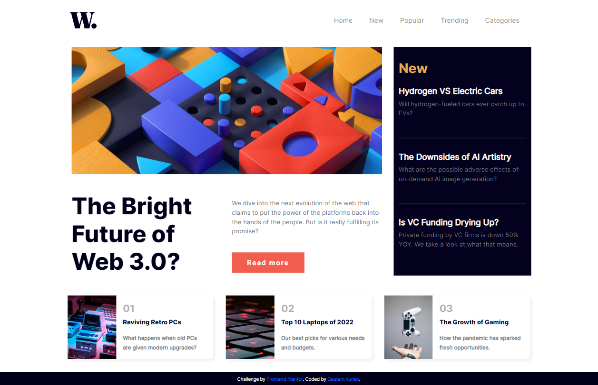

# Frontend Mentor - News homepage solution

This is a solution to the [News homepage challenge on Frontend Mentor](https://www.frontendmentor.io/challenges/news-homepage-H6SWTa1MFl). Frontend Mentor challenges help you improve your coding skills by building realistic projects. 

## Table of contents

- [Overview](#overview)
  - [The challenge](#the-challenge)
  - [Screenshot](#screenshot)
  - [Links](#links)
- [My process](#my-process)
  - [Built with](#built-with)
  - [What I learned](#what-i-learned)
  - [Continued development](#continued-development)
  - [Useful resources](#useful-resources)
- [Author](#author)
- [Acknowledgments](#acknowledgments)


## Overview

### The challenge

Users should be able to:

- View the optimal layout for the interface depending on their device's screen size
- See hover and focus states for all interactive elements on the page
- **Bonus**: Toggle the mobile menu (requires some JavaScript)

### Screenshot
Screenshots of how the page looks:



### Links

- Solution URL: [solution code](https://github.com/Gautambudh/News-homepage-with-hamburger-menu-for-mobile-view.git)
- Live site URL: [Live page](https://gautambudh.github.io/News-homepage-with-hamburger-menu-for-mobile-view/)

## My process

### Built with

- Semantic HTML5 markup
- CSS custom properties
- Bootstrap CSS Grid
- Mobile-first workflow
- Javascript for toggling the mobile nav menu

### What I learned

In this project i learnt to make hamburger toggling navigation menu for mobile view. I learnt how **document.queryselector(.class)** 
works and got familiar with the **classList.toggle("active")** method in javascript to add and remove a class in an HTML tag.
Also i learnt little bit of animations like ease in and out through CSS to make the nav menu appearance smooth.

A code snippet of how i achieve toggling of nav menu in Javascript:

```js
const mobile_nav = document.querySelector(".mobile-nav-btn");
const nav = document.querySelector(".nav");

// It will add and remove the 'active' class from the nav class, 
const toggleNavbar = () => {
    nav.classList.toggle("active"); // if active class present, it'll remove it and if not it'll add
}
// Whenever the menu icon btn is clicked, it will call the toggleNavbar() funtion 
mobile_nav.addEventListener("click", () => toggleNavbar());
}
```

### Continued development

I am further looking to add links for the different navigation pages

### Useful resources

- [Bootstrap 5](https://getbootstrap.com/) - This helped me for designing the responsive layout for desktop and mobile view. I'd recommend it to anyone still learning this concept.
- [hamburger icon](https://ionic.io/ionicons) - This is an amazing site for adding icons in projects. Must checkout coz it comes with functionality.
- [W3schools](https://www.w3schools.com/) - Another great website for learning all about frontend. I always takes help from this site.

## Author

- Frontend Mentor - [@Gautambudh](https://www.frontendmentor.io/profile/Gautambudh)

## Acknowledgments

Thapa technical is a youtube channel which helped me lot in learning the javascript toggle menu functionality.


